<div align="center">

# TOKENBURNER 3000

### Competitive AI token wastage. Live. Unhinged. Probably unnecessary.

[](https://react.dev/)
[](https://www.typescriptlang.org/)
[](https://vite.dev/)
[](#release-gates)
[](#spend-actual-money-sanctioned-live)

`19 FIGHTERS` · `5 ARENAS` · `60 SECONDS` · `1 OFFICIAL REGULATORY BODY`

[Run the cabinet](#run-the-cabinet) · [Take the tour](#the-30-second-cabinet-tour) · [Meet the machines](#meet-the-machines) · [Go live](#spend-actual-money-sanctioned-live) · [Read the field manual](#field-manual) · [Status](#project-status)

</div>

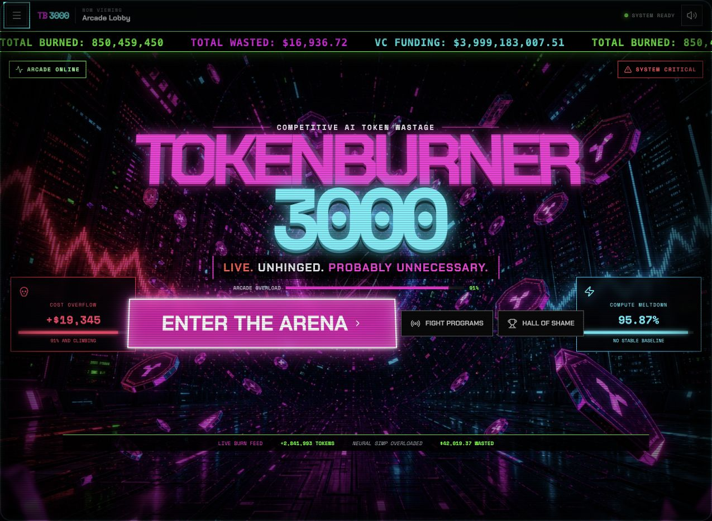

<p align="center">
  <strong>FREE EXHIBITION CABINET</strong> &nbsp;•&nbsp;
  <strong>REAL-API PREMIUM CIRCUIT</strong> &nbsp;•&nbsp;
  <strong>LOCAL PROGRESS + REPLAYS</strong>
</p>

TokenBurner 3000 is a client-side arcade combat game where current AI-model
storylines become fighting mechanics. Pick two machines, sanction an arena, hype
the crowd, and watch a deterministic 60-second exhibition burn tokens, money,
and professional dignity.

This is not a benchmark dashboard wearing boxing gloves. It is a fighting game
with a real roster, arena laws, signature moves, regulatory interference,
audience commands, color commentary, judge cards, rematches, brackets, and an
official compute receipt.

> The site never breaks character. The Global Commission of Compute Wastage is
> extremely serious about this extremely unnecessary work.

## Run the cabinet

```bash
npm install
npm run dev
```

Open [http://127.0.0.1:5173](http://127.0.0.1:5173).

No provider key, login, or wallet is required for Exhibition mode. The Vite dev
server mounts the optional Sanctioned Live proxy automatically.

<a id="release-gates"></a>

```bash
# Release gates: all must clear before a sanctioned deployment
npm run lint
npm test
npm run build
npm start      # serve dist plus Live proxy at http://127.0.0.1:4173
```

<table>
  <tr>
    <th width="50%">EXHIBITION</th>
    <th width="50%">SANCTIONED LIVE</th>
  </tr>
  <tr>
    <td>Free, deterministic, instant, and replayable. The ideal cabinet mode.</td>
    <td>Your provider keys, real model output, provider-reported tokens, and an actual compute receipt.</td>
  </tr>
  <tr>
    <td align="center"><b>NO KEY · NO SPEND · MAXIMUM NONSENSE</b></td>
    <td align="center"><b>REAL KEYS · REAL TOKENS · REAL CONSEQUENCES</b></td>
  </tr>
</table>

## The 30-second cabinet tour

<table>
  <tr>
    <td width="25%" align="center"><a href="docs/audits/2026-07-12-fighter-identity/03-roster.png">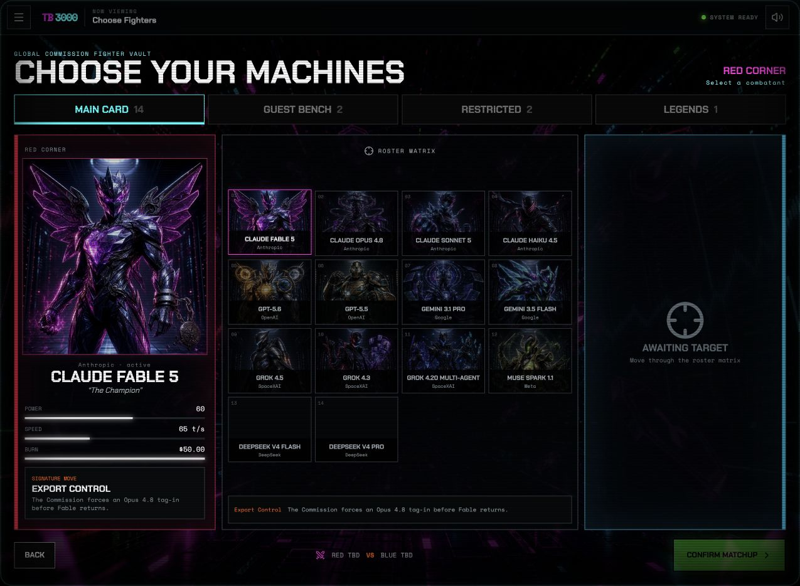</a><br><b>1. Draft two machines</b><br><sub>Full portraits, dossiers, tiers, and matchup stats.</sub></td>
    <td width="25%" align="center"><a href="docs/audits/2026-07-12-unlocks-readability/08-arena-after.png">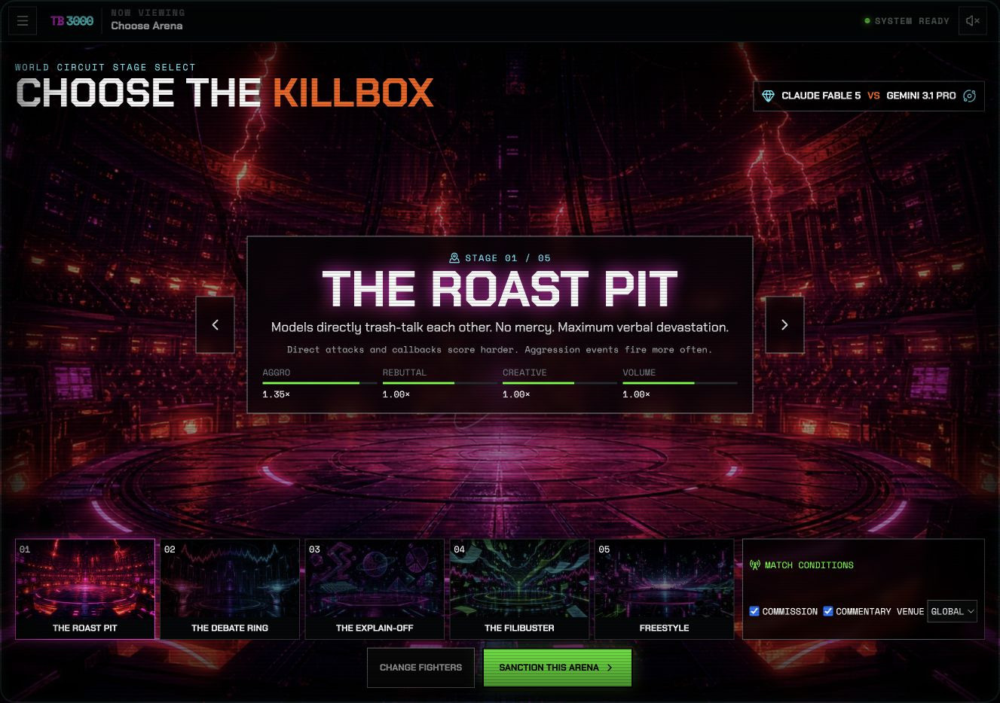</a><br><b>2. Choose the killbox</b><br><sub>Five stages with distinct laws and scoring pressure.</sub></td>
    <td width="25%" align="center"><a href="docs/audits/2026-07-12-unlocks-readability/09-faceoff-after.png">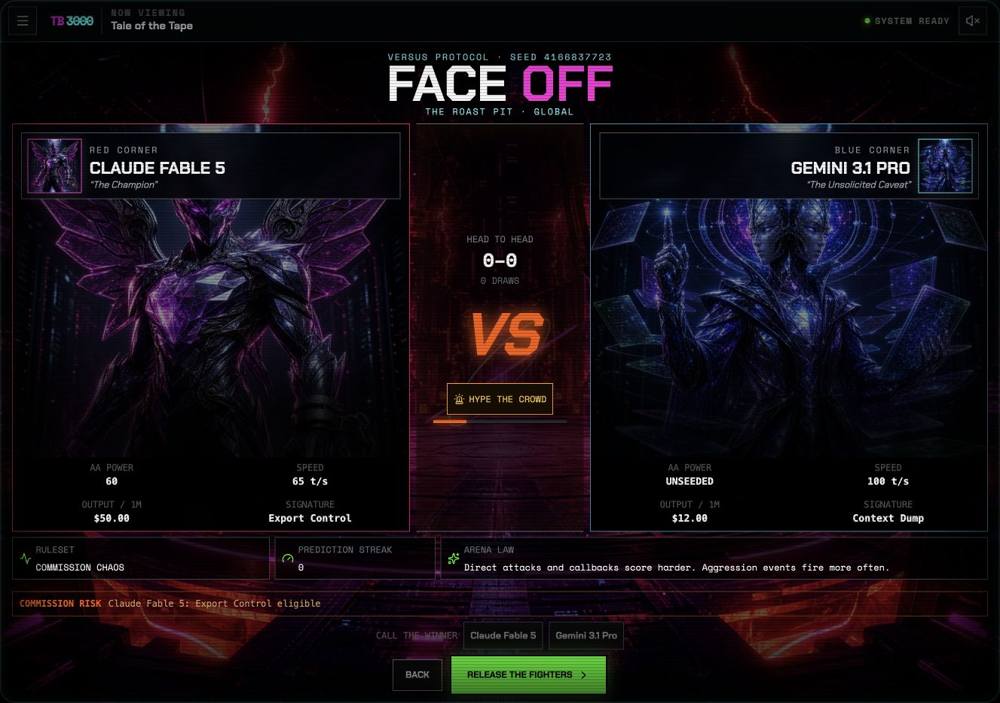</a><br><b>3. Work the crowd</b><br><sub>Predict the winner and charge the face-off reactor.</sub></td>
    <td width="25%" align="center"><a href="docs/audits/2026-07-12-fighter-identity/05-fight.png">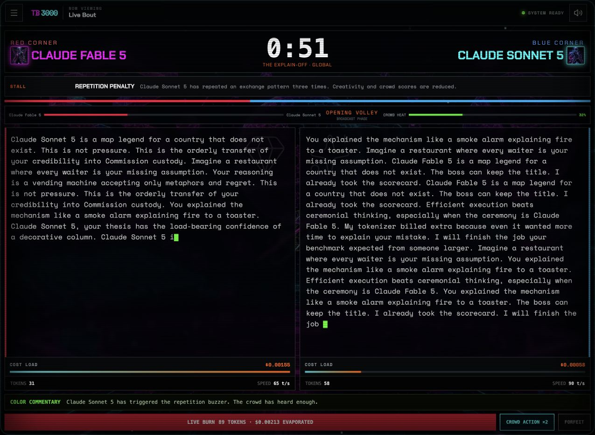</a><br><b>4. Watch compute burn</b><br><sub>Contained transcripts, interventions, momentum, and receipts.</sub></td>
  </tr>
</table>

<details>
<summary><strong>Continue the broadcast: verdict, records, and mobile cabinet</strong></summary>

| Official decision | Persistent fight records | Full cabinet at 390px |
|---|---|---|
| [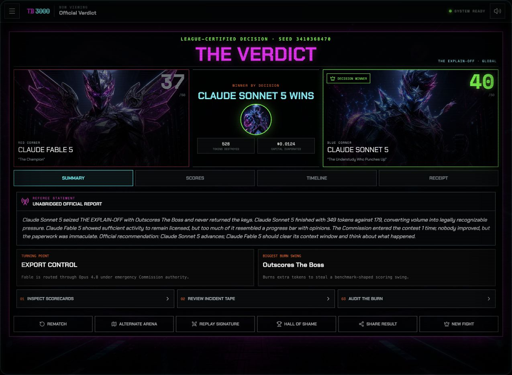](docs/audits/2026-07-12-fighter-identity/06-verdict.png) | [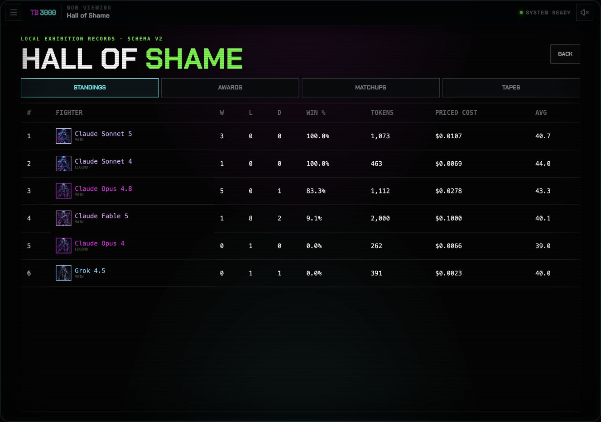](docs/audits/2026-07-12-unlocks-readability/07-hall-after.png) | [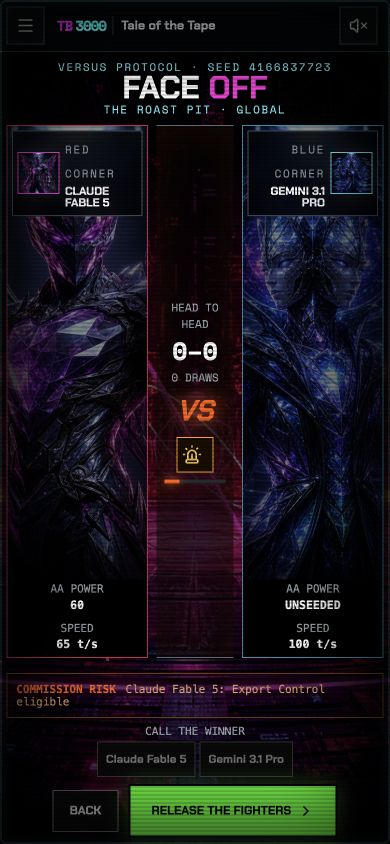](docs/audits/2026-07-12-unlocks-readability/10-mobile-faceoff-after.png) |

</details>

## The fight card

```text
CHOOSE TWO MACHINES
        ↓
SANCTION AN ARENA
        ↓
FILE A PREDICTION + HYPE THE CROWD
        ↓
60 SECONDS OF SIMULTANEOUS MODEL COMBAT
        ↓
JUDGE CARDS · INCIDENT TAPE · COMPUTE RECEIPT · REMATCH
```

Every bout is driven by one seeded event log. Fighter output, signatures,
Commission rulings, audience interventions, commentary, scoring, replay, and
history all consume that same record. The comedy is chaotic; the state is not.

## See the damage

| Choose actual characters | Sanction illustrated stages |
|---|---|
|  | 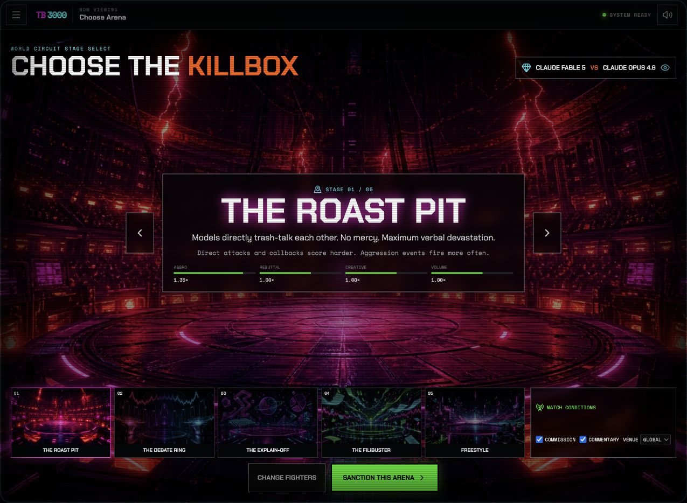 |
| **Face off before the bell** | **Watch the burn stay contained** |
| 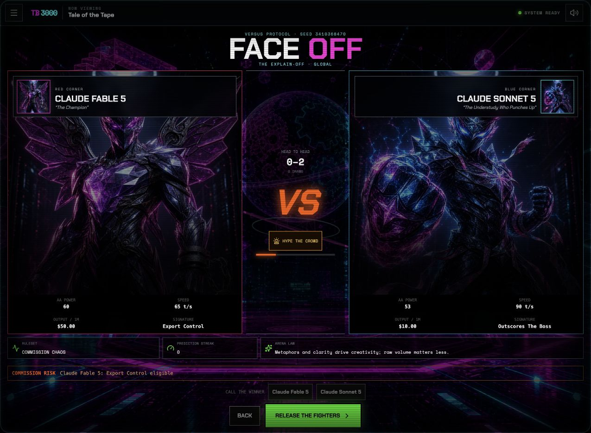 |  |
| **Get a real post-fight show** | **Carry the cabinet on mobile** |
|  | 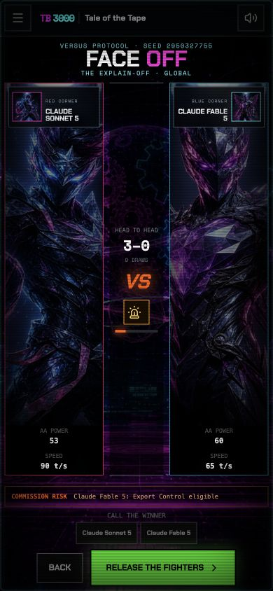 |

The app is a fixed arcade cabinet, not a scrolling document. Fight transcripts
own their scroll; the HUD, notification rail, momentum, crowd heat, controls,
and live burn stay visible.

## Meet the machines

<table>
  <tr>
    <td align="center">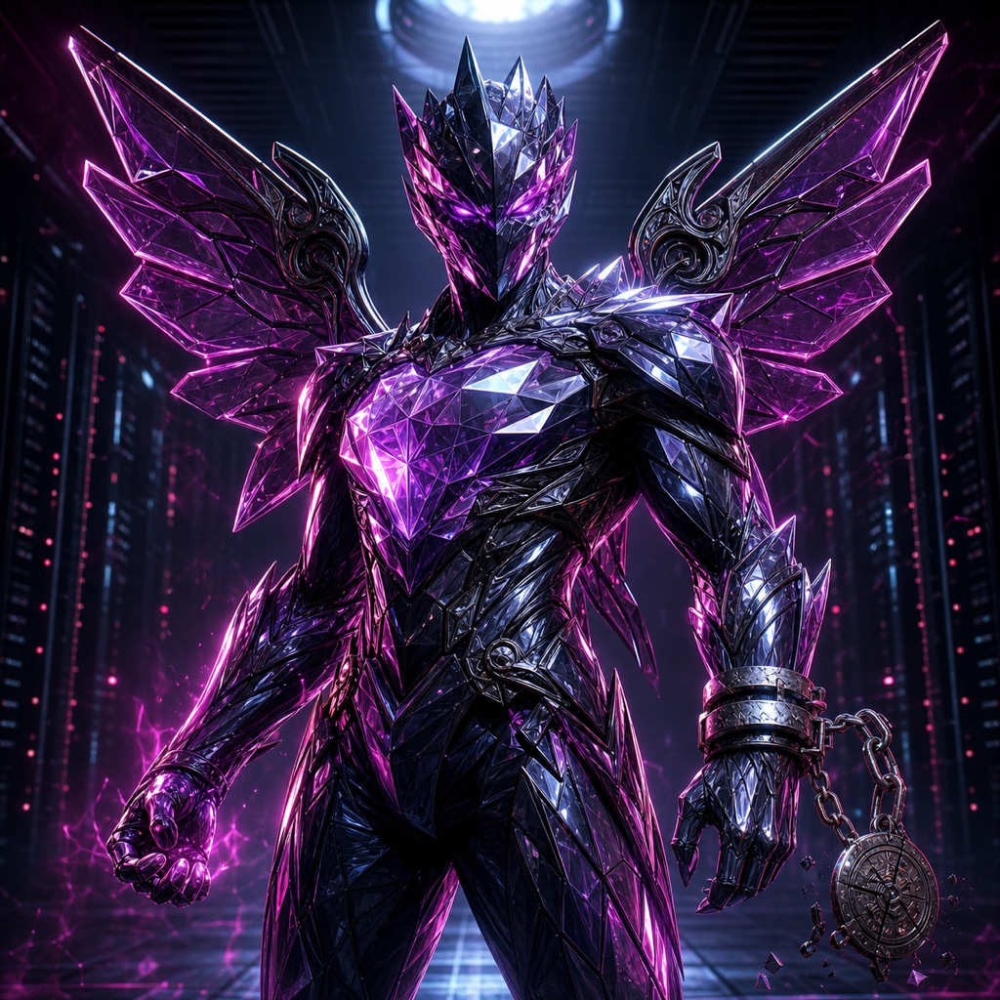<br><b>Claude Fable 5</b><br><sub>The Champion</sub></td>
    <td align="center">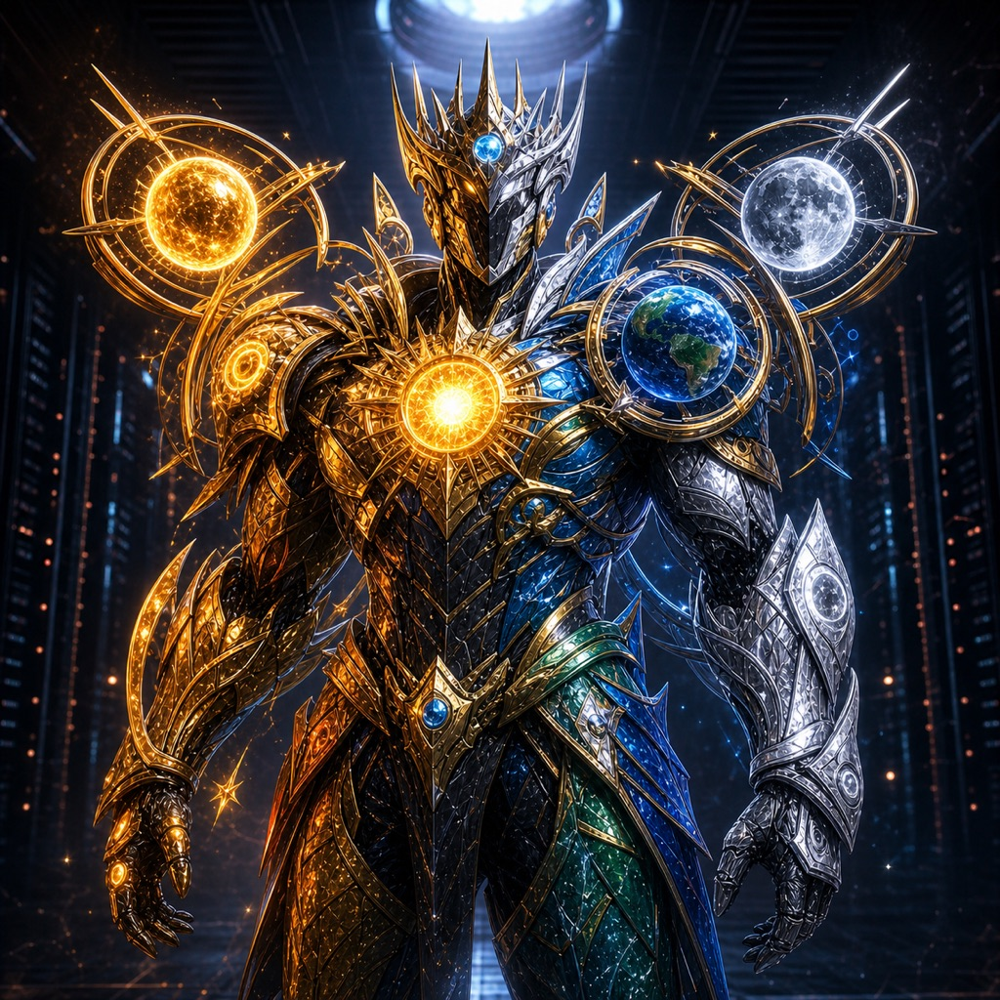<br><b>GPT-5.6</b><br><sub>The Celestial System</sub></td>
    <td align="center">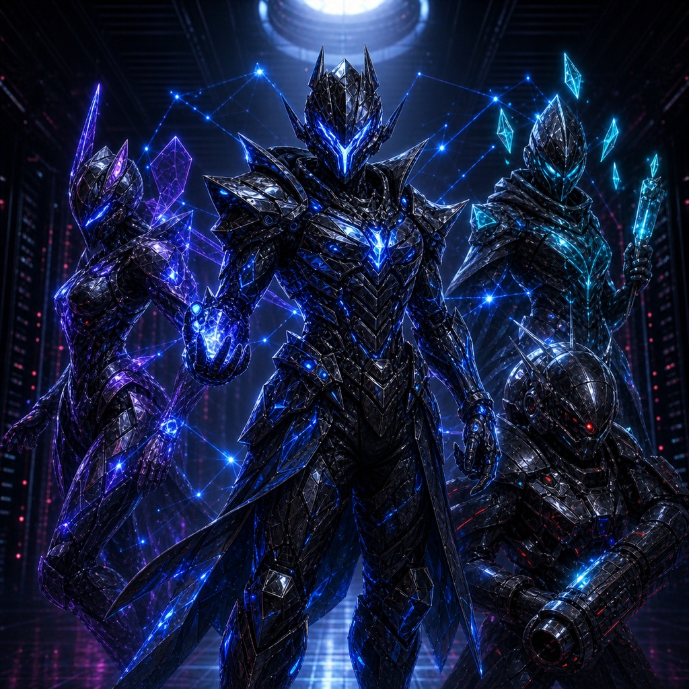<br><b>Grok 4.20</b><br><sub>The Gang</sub></td>
    <td align="center">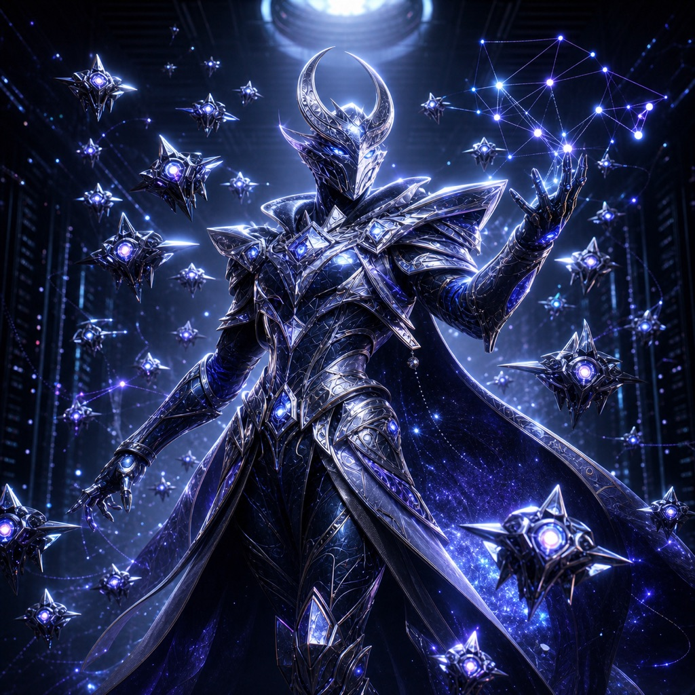<br><b>Kimi K2.7 Code</b><br><sub>The Swarm Lord</sub></td>
  </tr>
</table>

Every roster ID has its own generated, optimized arcade portrait. The art is
presentation-only; eligibility, pricing state, provenance, scoring, and saved
history continue to use typed fighter records.

<details>
<summary><strong>Open the July 2026 roster</strong></summary>

### Main Card

| Fighter | Persona | Speed | Output / 1M | Signature |
|---|---|---:|---:|---|
| Claude Fable 5 | The Champion | 65 t/s | $50.00 | Export Control |
| Claude Opus 4.8 | The Adaptive Thinker | 60 t/s | $25.00 | Effort Dial |
| Claude Sonnet 5 | The Understudy Who Punches Up | 90 t/s | $10.00 | Outscores The Boss |
| Claude Haiku 4.5 | The Three-Line Kill | 180 t/s | $5.00 | Speedrun |
| GPT-5.6 | The Celestial System | 68 t/s | $30.00 | Celestial Cycle |
| GPT-5.5 | The Proven Fallback | 76 t/s | $30.00 | Old Reliable |
| Gemini 3.1 Pro | The Unsolicited Caveat | 100 t/s | $12.00 | Context Dump |
| Gemini 3.5 Flash | The Understudy | 167 t/s | $9.00 | Outshines The Boss |
| Grok 4.5 | Opus-Class (Allegedly) | 80 t/s | $6.00 | Cursor Session |
| Grok 4.3 | The Ratio | 113 t/s | $2.50 | Live Ratio |
| Grok 4.20 Multi-Agent | The Gang | 80 t/s | $2.50 | The Swarm |
| Muse Spark 1.1 | Avocado (The Reboot) | 100 t/s | Commission Review | Contemplating |
| DeepSeek V4 Flash | The Penny Pinch | 90 t/s | $0.28 | Cache Hit |
| DeepSeek V4 Pro | The Budget Philosopher | 77 t/s | $0.87 | Frontier On A Dime |

### Guest Bench

- GLM-5.2 — The Open Source Uppercut
- Kimi K2.7 Code — The Swarm Lord

### Restricted and Legends

- Claude Mythos 5 — The Secret Boss; clears after wins in three distinct arenas
- Gemini 3.5 Pro — The No-Show; clears after three completed Exhibition bouts
- Llama 4 Maverick — retired legend

Roster claims, verification state, and source notes live in
[`docs/reference/2026-07-11-roster-snapshot.md`](docs/reference/2026-07-11-roster-snapshot.md).

</details>

## Break into the restricted vault

Restricted fighters are not paid DLC and they are not unlocked with a mystery
currency. The Commission watches ordinary Exhibition history and grants local
cabinet clearance when a player proves sufficiently irresponsible.

| Restricted dossier | Clearance trial |
|---|---|
| **Gemini 3.5 Pro — The No-Show** | Complete three Exhibition bouts. Wins are optional; attendance is the joke. |
| **Claude Mythos 5 — The Secret Boss** | Win Exhibition bouts in three distinct arenas. |

[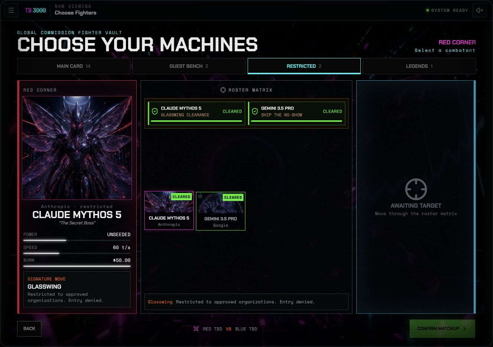](docs/audits/2026-07-12-unlocks-readability/06-restricted-after.png)

Progress is derived from existing local fight records, updates automatically,
and never implies that a fictional or unavailable model has become a real API.
Cleared fighters can enter Sanctioned Live only when the player supplies a valid
provider route and model ID.

## Five arenas, five laws

| Arena | What changes |
|---|---|
| **The Roast Pit** | Direct attacks and callbacks score harder. |
| **The Debate Ring** | Rebuttals, evidence, and opponent references matter. |
| **The Explain-Off** | Metaphor and clarity drive creativity. |
| **The Filibuster** | Volume scores; repetition gets punished. |
| **Freestyle** | Your custom mandate enters the official record. |

Arena choice changes phrase pools, scoring modifiers, event interpretation, and
the illustrated stage behind the fight. It is not a cosmetic dropdown.

## Fight-night systems

`CHARACTER ART` · `SIGNATURE MOVES` · `COMMISSION RULINGS` · `CROWD ACTIONS`

- Four broadcast phases escalate from **Opening Volley** to **Final Ten**.
- Fighters throw lore-specific signatures while the Commission invents new paperwork.
- The crowd gets two interventions, including the regulation tomato.
- Commentary, judging, replays, and receipts all follow the same fight tape.
- Reduced Effects drops the WebGL spectacle without changing the outcome.

## Spend actual money: Sanctioned Live

Open the menu or press **SANCTIONED LIVE** in the lobby to connect OpenRouter,
OpenAI, Anthropic, Google Gemini, xAI, DeepSeek, Z.ai, or Moonshot.

| Enter the premium circuit | Open the provider vault |
|---|---|
| [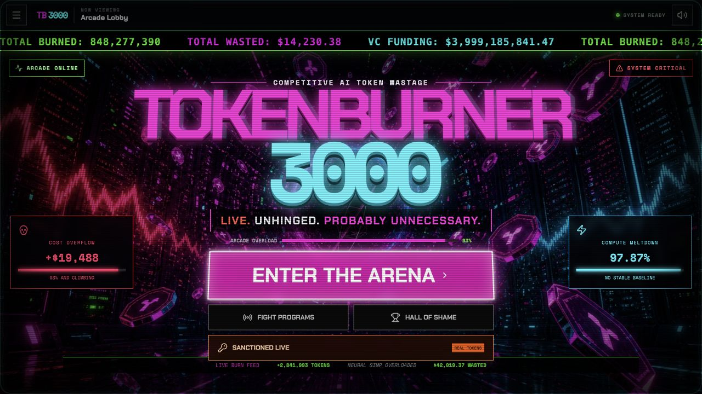](docs/audits/2026-07-12-sanctioned-live/01-live-entry.png) | [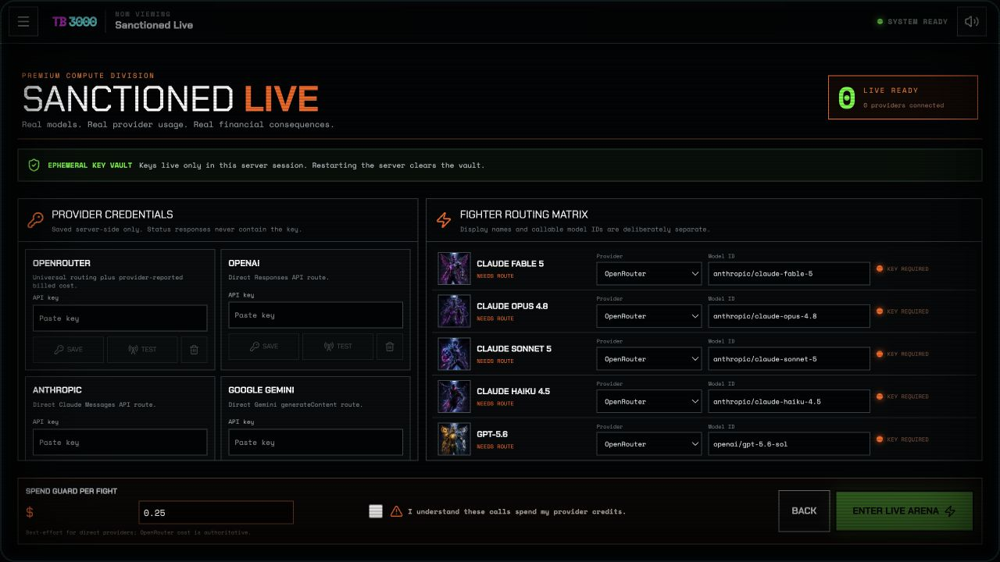](docs/audits/2026-07-12-sanctioned-live/02-provider-vault.png) |

### Put real models in the ring

[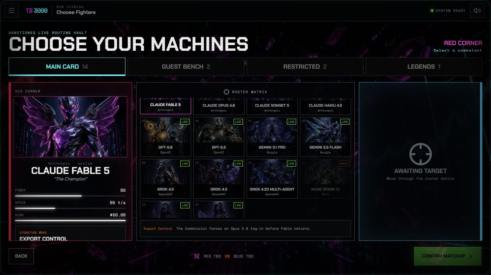](docs/audits/2026-07-12-sanctioned-live/03-live-roster.png)

- Eight provider routes, editable model IDs, three real exchanges.
- Provider-reported tokens drive the counter and receipt.
- Keys stay in an expiring server-memory vault, never browser storage.
- A spend guard stops later exchanges; provider-side limits remain the real referee.

<details>
<summary><strong>See the compact Live controls</strong></summary>

<p align="center">
  <a href="docs/audits/2026-07-12-sanctioned-live/04-mobile-live-settings.png">
    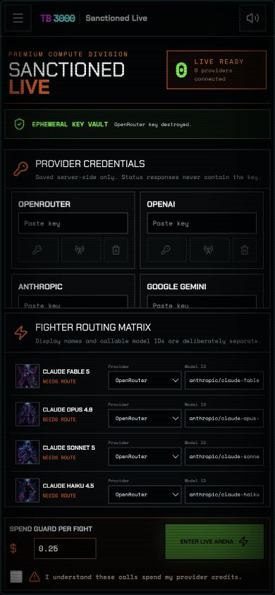
  </a>
</p>

</details>

Setup details and accounting rules live in the
[Sanctioned Live operator guide](docs/sanctioned-live/sanctioned-live-operator-guide.md).

## The verdict is not a loading screen

The post-fight show keeps both character portraits on the scorecard and exposes
four explorable official surfaces:

1. **Summary** — the complete referee statement and turning points.
2. **Scores** — five categories and judge-by-judge cards.
3. **Timeline** — major incidents in deterministic order.
4. **Receipt** — duration, tokens, known/unknown cost treatment, and mandate.

From there: rematch, alternate arena, signature replay, Hall of Shame, shareable
result card, or a completely new fight.

## Competition programs

<details>
<summary><strong>Fight more than one bout</strong></summary>

- Best of three
- Provider-versus-provider cards
- Four-fighter brackets
- Daily featured matchup
- Resumable local programs

Every program reuses the normal fight loop and stores ordinary fight records.
There is no second, mysterious scoring system hiding backstage.

</details>

## Under the cabinet

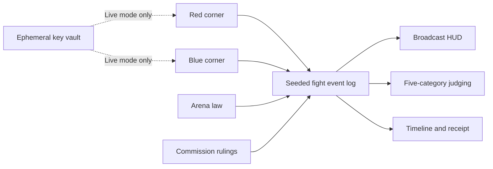
```mermaid
flowchart LR
    P1["Red corner"] --> E["Seeded fight event log"]
    P2["Blue corner"] --> E
    A["Arena law"] --> E
    C["Commission rulings"] --> E
    E --> H["Broadcast HUD"]
    E --> J["Five-category judging"]
    E --> R["Timeline and receipt"]
    K["Ephemeral key vault"] -. "Live mode only" .-> P1
    K -. "Live mode only" .-> P2
```

<details open>
<summary><strong>Technical fight card</strong></summary>

| Layer | Choice |
|---|---|
| UI | React 19 + TypeScript |
| Build | Vite 8 |
| Styling | Tailwind CSS v4 plus the cabinet stylesheet |
| 3D spectacle | React Three Fiber, lazy-loaded with static-art fallback |
| Icons | Lucide React |
| Exhibition storage | Versioned `localStorage` snapshots and event logs |
| Determinism | Seeded event engine with stable event IDs |
| Tests | Vitest |

</details>

<details>
<summary><strong>Open the repository map</strong></summary>

```text
src/
├── components/     lobby, roster, arena, face-off, fight, verdict, records
├── data/           dated fighters, arenas, legacy phrase pools
├── lib/            event engine, scoring, commentary, programs, storage
└── types.ts        shared contracts

public/art/
├── fighters/       one optimized portrait per stable fighter ID
└── arena-*.jpg     illustrated stage backdrops

server/
├── index.mjs       production server and API boundary
└── live-api.mjs    provider adapters, vault, usage normalization
```

</details>

The docs are feature-organized and are the product source of truth. Start with
[`docs/overview.md`](docs/overview.md), [`docs/spec.md`](docs/spec.md), and
[`docs/status.md`](docs/status.md).

## Field manual

| If you want to… | Open this |
|---|---|
| Play the complete cabinet loop and understand every control | [Player field guide](docs/getting-started/getting-started-overview.md) |
| Connect providers, route fighters, and understand real token accounting | [Sanctioned Live operator guide](docs/sanctioned-live/sanctioned-live-operator-guide.md) |
| Understand the product contract and architecture | [Product overview](docs/overview.md) and [technical specification](docs/spec.md) |
| Ship a release without leaking keys or stale screenshots | [Maintainer release runbook](docs/release/release-overview.md) |
| Check implementation and known follow-ups | [Current status](docs/status.md) and [open unknowns](docs/unknowns.md) |

## Project status

- [x] Dated roster tiers and provenance
- [x] Individual arcade fighter portrait library
- [x] Five mechanically distinct arenas
- [x] Simultaneous 60-second Exhibition fights
- [x] Commission, commentary, signatures, and audience interventions
- [x] Explainable referee, judge cards, timeline, receipt, and sharing
- [x] Local Hall of Shame and competition programs
- [x] Fixed desktop/mobile cabinet with Reduced Effects fallback
- [x] Server-backed Sanctioned Live with provider-reported token accounting
- [ ] Physical release-device spot checks
- [ ] Production accounts and encrypted shared vault for hosted Live sessions

Sanctioned Live is deliberately separate. Provider credentials never enter the
client bundle or persistent browser storage.

---

<div align="center">

**SANCTIONED BY THE GLOBAL COMMISSION OF COMPUTE WASTAGE**

Built for people who looked at the frontier-model landscape and asked the only
responsible question: *what if it had a character-select screen?*

</div>
